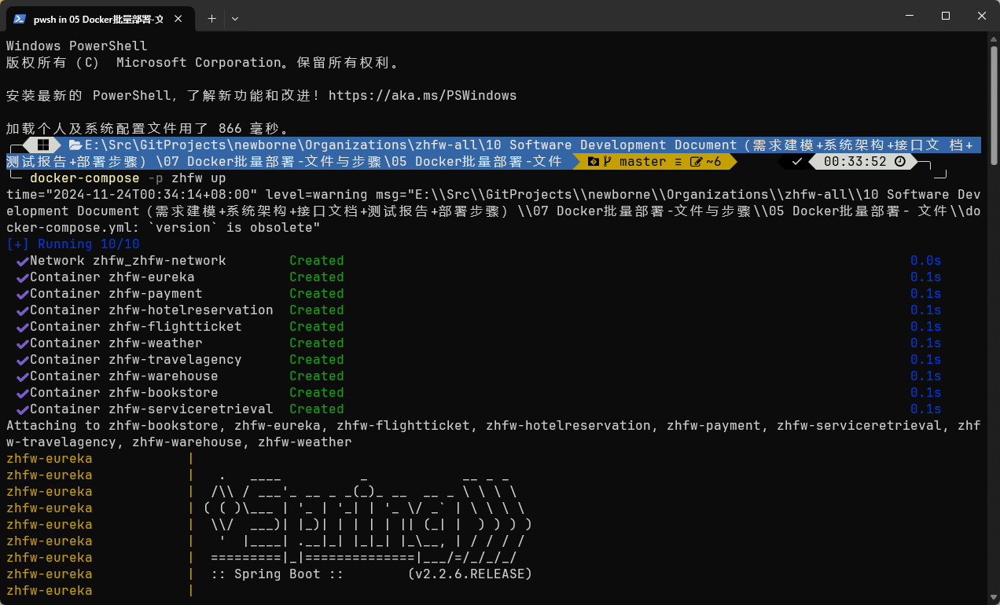

1. 对每个服务进行maven clean install（pom文件里已经引入docker打包依赖，会自动根据Dockerfile生成指定Docker镜像并上传至指定的服务器）

2. 将docker-compose.yml上传到服务器

3. 在指定服务器终端内执行

   ```bash
   docker-compose -p zhfw up   
   ```

4. 部署运行图

   